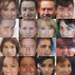

# DL-ImageGenerator
 Pytorch image generator using GANs. This code can train a GAN and use it to generate new images

## Requirements
- Install PyTorch ([pytorch.org](http://pytorch.org))
- `pip install -r requirements.txt`

## Path to dataset to train or test
The code expects your dataset folder to have the following structure:

	dataset/
		*/
            *.jpg
            *.jpg

## Usage
```
usage: ImageGenerator.py [-h] [--data_dir DATA_DIR] [--epochs EPOCHS]
                         [--print_every PRINT_EVERY]
                         [--generator_path GENERATOR_PATH] [--nimages NIMAGES]
                         [--gpu]

Train and generate images using GANs

optional arguments:
  -h, --help            show this help message and exit
  --data_dir DATA_DIR   Path to dataset to train
  --epochs EPOCHS       Number of epochs for training
  --print_every PRINT_EVERY
                        Print every x steps in the training
  --generator_path GENERATOR_PATH
                        Path to a pre-trained generator
  --nimages NIMAGES     Num images to generate
  --gpu                 Train using CUDA:0
```

## Usage training example
```
python ImageGenerator.py --gpu --data_dir="~/.torch/datasets/celeba" --epoch 20
```
## Usage generate example
```
python ImageGenerator.py --gpu --generator_path="output/celeba/celeba_G.pkl" --nimages 50
```
